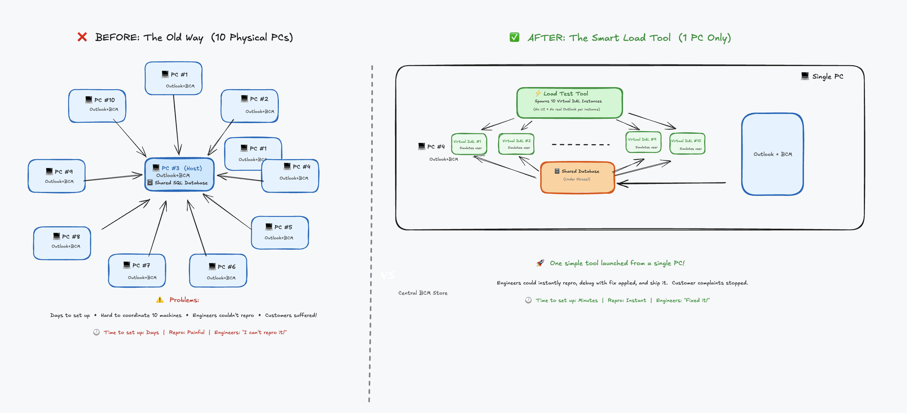
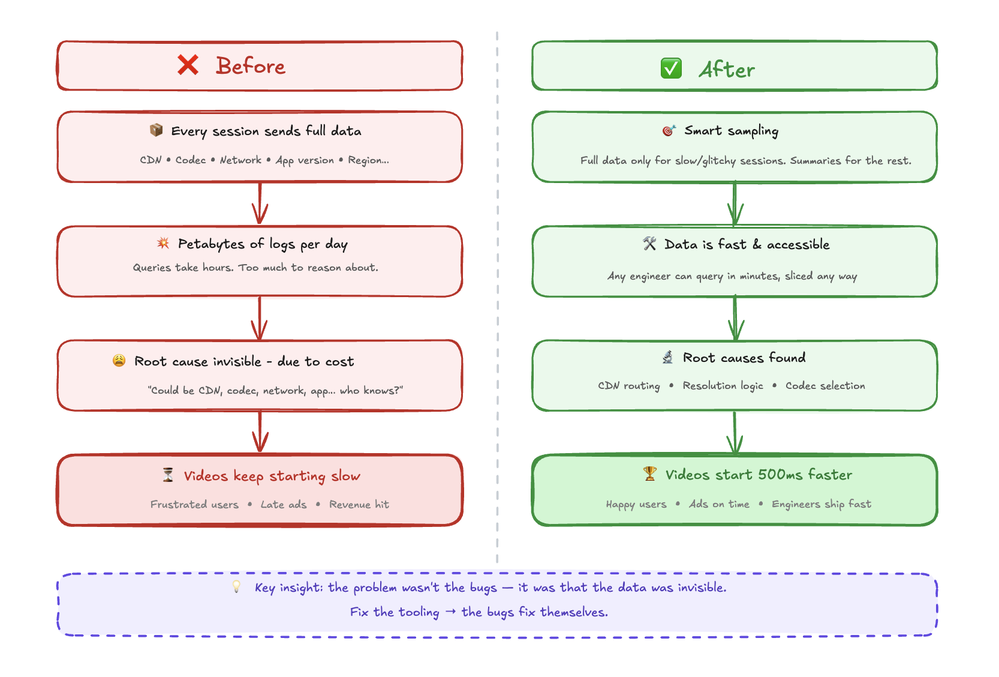
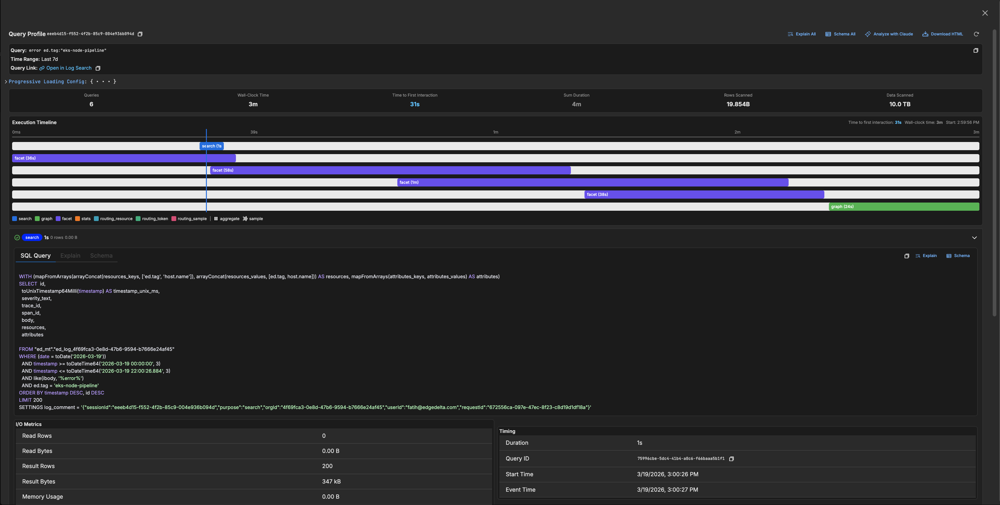

# The Art of Making Performance Problems Impossible to Ignore

Since my early days as an engineer, performance has been my passion. It signals care for the product and respect for customers' time. Trust is easily lost when timeouts and errors start popping up at scale.

Performance work is unique and requires deep understanding of all components and how they interact. I find it fascinating, even though it's incredibly time-consuming. But here's the uncomfortable truth: when reproduction is hard or gathering information about issues is difficult, engineers pay less attention. Sometimes they ignore performance problems entirely.

I'd bet countless performance issues go unresolved simply because generating large datasets or network loads is hard. This is why attacking performance is first and foremost a **tooling problem**. We need to make it stupidly simple for developers to reproduce issues. If they can reproduce quickly, they can identify bottlenecks and iterate. Performance is a continuous battle, and without the right tooling, even today's improvements will drift back tomorrow.

The goal is simple: **make invisible things visible with minimal effort**. Make it so obvious that there's no excuse to look away.

## Story 1: The Outlook Database That Couldn't Scale

In my early days at Microsoft, I worked on Business Contact Manager, an Outlook add-on that transformed it into a small business CRM. It had a shared database that multiple Outlook clients connected to. Every UI action hit this central database.

Our customers complained constantly. With just 10 employees connecting to the same database, switching search folders or adding items became painfully slow. The application was nearly unusable.

The team's approach? Automate installing Outlook on multiple desktops, connect them to the shared database, and use UI test tools to mimic folder switching so engineers could debug. Imagine coordinating 10 different PCs. The setup time alone was enormous.

I took a different approach. I stripped out the UI element from Outlook, launched just one instance, and built a load tool that spawned 10 instances of the data access layer. It mimicked activities like search folder switches and item additions continuously. When you tried to use Outlook with this tool running, you immediately saw what customers were experiencing.

Engineers had no excuse anymore. Launch one tool, stress the database, instant reproduction. They could test fixes immediately. It became stupidly simple to reproduce, and guess what? Performance issues got resolved very quickly.

## Story 2: Why Twitter Videos Were Slow to Start

At Twitter, people complained about video start latency. The challenge was multidimensional: which CDN was used, which codec, which network provider, which mobile app version. Any combination could cause delays. Customers got frustrated. Ads started late. Revenue was at risk.

The root cause was nearly impossible to find because the problem was buried in volume. We needed data from every session to investigate arbitrary issues. The data collection alone was overwhelming.

Instead of fighting the data problem head-on, we shifted focus to tooling. What if we only collected detailed telemetry for sessions with high delay or glitches, while successful sessions just delivered a summary? This tooling improvement solved the data problem and made critical information accessible to engineers immediately.

Suddenly, we discovered CDN routing inefficiencies. We found resolution selection bugs. We uncovered codec selection problems. Making these invisible parts visible made fixing performance issues trivial.

## Story 3: The ClickHouse Journey at Edge Delta

The same pattern emerged at Edge Delta. Customers were experiencing performance issues with large time-window queries in our log search. Queries that should return in seconds were timing out. But understanding why? Nearly impossible.

The challenge was complexity. A single page load triggered dozens of queries (search queries, facet queries, graph queries, stats queries) all hitting different tables with different routing strategies. Which query was slow? Which table was being scanned? Was the bloom filter index being used? Were we hitting the sample table or the full table? Without visibility into this, engineers were debugging blind.

This is where we applied the same philosophy: **make the invisible visible**.

We built a query profiler that captures everything about a log search session: every query that hits the database, their execution order, the exact SQL with all parameters, the EXPLAIN plan, the schema being used, I/O metrics (rows read, bytes scanned, memory usage), and timing breakdowns. Engineers could now click a "Profile" button after any search and see a complete execution timeline showing which queries ran in parallel, which were sequential, and where the time actually went.

Suddenly the bottlenecks were obvious. We could see queries scanning 5TB of data when they should have been using skip indexes. We could see facet queries taking longer than the main search. We could see routing decisions sending queries to the wrong table. With this visibility, my colleagues could attack the actual problems. On the backend, we dove deep into ClickHouse internals, optimizing query execution paths, improving partition pruning, and tuning how we structure data for time-range queries. On the frontend, we ensured the UI remained responsive during long-running queries, implementing progressive loading and fixing rendering bottlenecks that made slow queries feel even slower.

The results spoke for themselves. Queries that previously timed out now complete in seconds. What changed wasn't just the code. It was our ability to see, measure, and iterate on performance continuously.

## The Pattern

Three companies, three different problems, one consistent lesson: **performance work is tooling work**.

When you make reproduction trivial, engineers can't ignore problems. When you make measurements automatic, performance becomes part of the development cycle, not an afterthought. When you make the invisible visible, fixes become obvious.

If you're struggling with performance issues in your product, don't start by optimizing code. Start by asking: "How easy is it for any engineer on my team to reproduce this problem right now?" If the answer is anything other than "trivially easy," that's your first problem to solve.

Make it stupidly simple. Leave no excuses.

---

**Continue reading:** [ClickHouse Log Search Optimizations: Technical Deep Dive](clickhouse-optimizations.html), a detailed breakdown of the six optimizations that transformed our log search from timing out to sub-second responses.
